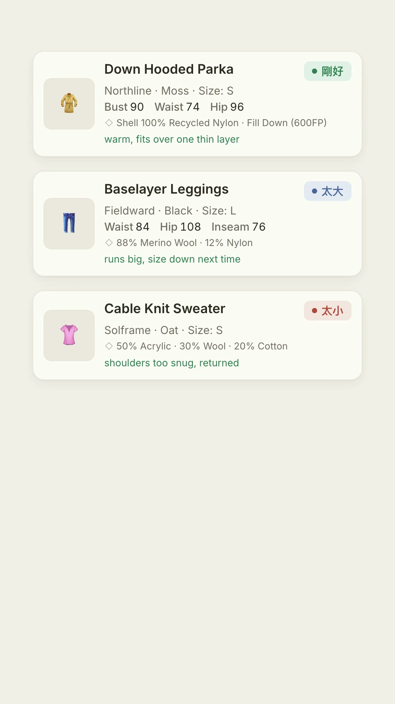
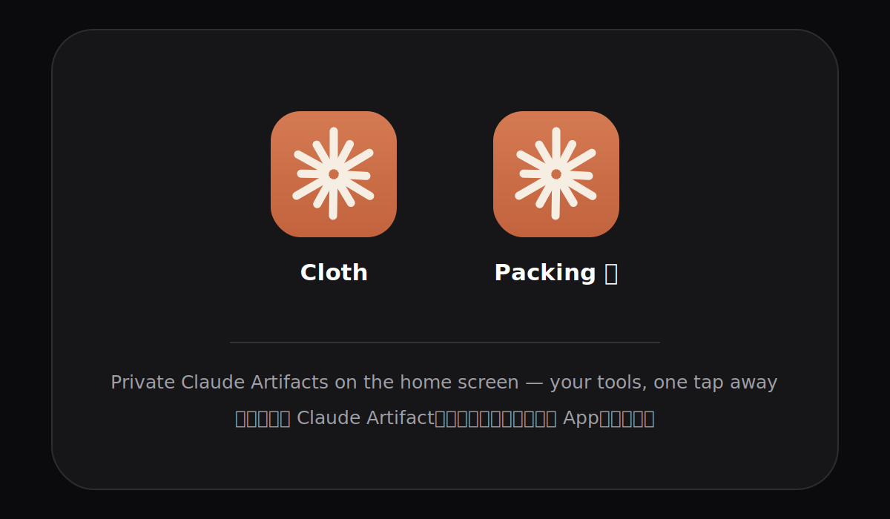

# Fitting Room 🧥

**🇬🇧 [English](#english)** · **🇹🇼 [繁體中文](#繁體中文)**

---

## English

> Introducing Fitting Room 🧥: a private, offline fit-history reference for your
> changing-room moment — every garment gets exactly one verdict, too small · fit · too big, and you
> never have to guess your size in a brand again.

### What is this, really?

Imagine a little private webpage, just for you, that lists every piece of clothing
you've bought — brand, size, the actual body measurements for that size, and whether it
fit "too small", "just right" or "too big". You built up that list once, and from then
on, whenever you're shopping and unsure which size to grab, you open the link on your
phone and check.

It's not an app you install. It's a single webpage that Claude builds for you and
privately hosts — nobody else can see it unless you choose to share it.

### See it in action

🎬 [Full-quality demo video](demo.mp4)

### What you get

- A phone-sized list of everything you've bought, filterable by category (tops, bottoms,
  outerwear, whatever categories you choose) and by season.
- Each item shows brand, colour, size, measurements, material, your own notes, and a
  clear "too small / just right / too big" badge.
- A search box, and a cm ⇄ inches toggle.
- An optional per-category "typical size range" reminder — e.g. "for tops, I'm usually a
  Bust 87–93".
- Everything lives in one file with no ads, no tracking, no sign-up — just a private link
  only you (or people you choose to share it with) can open.

### How to make your own — no coding experience needed

You don't need to know how to code. You just need Claude (Claude Code, or a Claude app
with Skills support) and a few minutes.

1. **Get this skill into Claude.** *(see "Installing the skill" below — this part depends
   on which Claude product you're using.)*
2. **Say what you want**, e.g. *"set up a fitting room for my clothes"*. Claude will read
   `SKILL.md` and take it from there.
3. **Answer a few quick questions** — what language you want the labels in (English,
   Traditional Chinese, or your own mix), what categories of clothing you buy, and what
   accent colour you like. There are sensible defaults for all of it — you can just say
   "defaults are fine".
4. **Give Claude your first few items** — a link to the product page, a photo of a size
   tag, or just tell it the details out loud ("Uniqlo AIRism tee, size S, felt a bit
   snug"). Claude will show you a summary table before saving anything, so you can correct
   it.
5. **Claude publishes it** and gives you a private link. Add it to your phone's home
   screen so it's one tap away — see "Add it to your phone's home screen" below for
   step-by-step iPhone and Android instructions.
6. **Next time**, just come back to the same Claude conversation (or a new one, if you
   tell Claude the link) and say things like *"add this jacket I just bought"* — Claude
   updates the same page, it doesn't create a new one.

### Installing the skill

This skill works with **Claude Code** — Anthropic's developer tool (available as a
desktop app, a VS Code/JetBrains extension, or a terminal app). It does **not** currently
work in the regular claude.ai chat website, since custom Skills aren't supported there yet.
Dragging the folder into a claude.ai **Project**'s knowledge library doesn't work either —
Claude can read the instructions there, but a Project can't actually run the multi-step
build-and-publish workflow `SKILL.md` describes (copying files, running `build.py`,
publishing an Artifact).

1. **Download this folder.** On GitHub, click the green "Code" button → "Download ZIP"
   (or `git clone` the repo if you're comfortable with git), then find the `fitting-room`
   folder inside.
2. **Copy the `fitting-room` folder** into a `skills` folder that Claude Code looks in:
   - To use it in *every* project: `~/.claude/skills/fitting-room/` (inside your home
     folder — on Mac that's usually `/Users/yourname/.claude/skills/`, on Windows
     `C:\Users\yourname\.claude\skills\`). Create the `skills` folder if it doesn't exist yet.
   - To use it in *one specific project only*: put it in that project's
     `.claude/skills/fitting-room/` instead.
3. **Open Claude Code** in that project (or anywhere, if you used the personal folder)
   and either:
   - type `/fitting-room`, or
   - just say something like *"set up a fitting room for my clothes"* — Claude recognises
     the request from the skill's description and picks it up automatically.

No extra installation, sign-up, or payment needed beyond having Claude Code itself.

### Add it to your phone's home screen

There's no App Store submission and nothing to install — the tool is just a private
webpage, so you bookmark it onto your home screen and it sits next to your real apps,
one tap away in the changing room:

**On iPhone (Safari):**

1. Open your artifact link in **Safari**, logged into your claude.ai account (the page is
   private, so a browser that isn't logged in can't open it). If the link opened inside
   another app's built-in browser, use that app's menu to open the page in Safari first.
2. Tap the **Share** button (the square with an upward arrow) at the bottom of the screen.
3. Scroll down and tap **Add to Home Screen**.
4. Give it a short name — "Cloth", "Fitting Room", emoji welcome — and tap **Add**.

**On Android (Chrome):**

1. Open your artifact link in **Chrome**, logged into your claude.ai account.
2. Tap the **⋮** menu in the top-right corner.
3. Tap **Add to Home screen**, and choose the shortcut option if Chrome asks.
4. Give it a name and confirm.

Two things worth knowing:

- The icon is a bookmark that looks like an app, not an offline app — opening it needs an
  internet connection and your claude.ai login.
- When Claude later updates your page (same link), the icon automatically opens the newest
  version. You never need to re-add it.

### Is my data private?

Yes. The tool is published as a **private Claude Artifact** — by default, only you (while
logged into your Claude account) can open the link. Nothing is public unless you
deliberately share it from the artifact page. Your measurements aren't sent anywhere
except to Claude while you're chatting with it, the same as any other conversation.

### Can I change how it looks or what it tracks?

Yes, any time — just ask Claude, in the same conversation or a new one. Categories,
seasons, colours, and the on-screen language are all just settings in a `data.json` file
that Claude edits for you; you never touch code directly. If you *do* want to peek under
the hood, see `SKILL.md` for the full data model.

### FAQ

- **Do I need to know Python or HTML?** No — Claude runs everything for you. The scripts in
`reference/` exist so Claude doesn't have to reinvent them each time, not for you to run
by hand.

- **What if I don't want product photos?** Totally fine, just say so during setup — the app
looks clean either way, showing a category label instead of a thumbnail.

---

## 繁體中文

### 什麼是 Fitting Room？

想像有一個只屬於你的私人網頁，記錄你買過的每一件衣服──品牌、尺寸，以及穿起來是「太小」、「剛好」還是「太大」。花一點時間建立起這份清單後，之後不管是逛街還是在網路上買衣服，只要拿出手機打開連結查一下就好，不用再靠記憶猜尺寸。

這不是要另外安裝的 App。它是 Claude 幫你產生、並且私密託管的一個網頁──除非你自己選擇分享，否則沒有其他人看得到。

### 實際看看

🎬 **[觀看完整示範影片(有背景音樂)](demo.mp4)**

### 你會得到什麼

- 一份手機尺寸剛好的清單，可以依分類（上衣、褲子、外套……你自訂）跟季節篩選。
- 每件單品顯示品牌、顏色、尺寸、量測數字、材質、你自己寫的心得，以及清楚的「太小／剛好／太大」標籤。
- 搜尋框，還有 cm／英吋 單位切換。
- 每個分類可選擇性顯示「常見尺寸範圍」小提醒，例如「上衣通常是 Bust 87–93」。
- 全部濃縮成一個檔案，沒有廣告、沒有追蹤、不用註冊──只有一個私人連結，只有你（或你選擇分享的人）能打開。

### 怎麼建立自己的版本──完全不用會寫程式

你不需要懂任何程式語言，只需要 Claude（Claude Code，或支援 Skills 功能的 Claude App），還有幾分鐘時間。

1. **把這個 skill 放進 Claude。**（實際做法請見下方「安裝 Skill」，依你使用的 Claude 產品而定。）
2. **直接說出你的需求**，例如「幫我建一個記錄衣服尺寸的 fitting room」，Claude 會讀取 `SKILL.md` 接手處理。
3. **回答幾個簡單的問題**──介面要用什麼語言（英文、繁體中文，或自己混搭）、你平常買哪些分類的衣服、喜歡哪個主題色。每一項都有預設值，你也可以直接說「用預設的就好」。
4. **提供你的前幾件單品資料**──可以給商品連結、size tag 的照片，或直接口頭描述（「Uniqlo AIRism 短袖，S 號，穿起來有點緊」）。Claude 會先列出摘要表格讓你確認，不會自作主張直接存檔。
5. **Claude 幫你發布**，給你一個私人連結。建議加到手機主畫面，之後一鍵就能打開──iPhone 和 Android 的詳細步驟見下方「加到手機主畫面」。
6. **之後要更新**，回到同一個 Claude 對話（或在新對話中把連結告訴 Claude），跟它說「幫我加一件剛買的外套」就好──Claude 會更新同一個頁面，不會另外生出一個新的。

### 安裝 Skill

這個 skill 需要搭配 **Claude Code** 使用──也就是 Anthropic 的開發者工具（有桌面版 App、VS Code／JetBrains 外掛，或終端機版本）。目前一般的 claude.ai 聊天網站**還不支援**自訂 Skills，所以無法在那邊使用。把整個資料夾拖進 claude.ai **Project** 的知識庫也一樣行不通──Claude 讀得到裡面的文字說明，但 Project 沒辦法真的執行 `SKILL.md` 要求的建置流程（複製檔案、跑 `build.py`、發布 Artifact）。

1. **下載這個資料夾。** 在 GitHub 頁面點綠色的「Code」按鈕 → 「Download ZIP」（或如果你熟悉 git，也可以直接 `git clone` 整個 repo），下載後找到裡面的 `fitting-room` 資料夾。
2. **把 `fitting-room` 資料夾複製**到 Claude Code 會讀取的 `skills` 資料夾裡：
   - 想在**所有專案**都能用：放到 `~/.claude/skills/fitting-room/`（也就是你使用者資料夾裡，Mac 上通常是 `/Users/你的名字/.claude/skills/`，Windows 上是 `C:\Users\你的名字\.claude\skills\`）。如果 `skills` 資料夾還不存在，直接建立一個就好。
   - 只想在**單一專案**使用：放到該專案裡的 `.claude/skills/fitting-room/`。
3. **在該專案中開啟 Claude Code**（如果放在個人資料夾，任何專案都可以），接著：
   - 輸入 `/fitting-room`，或
   - 直接說「幫我建一個記錄衣服尺寸的 fitting room」──Claude 會從 skill 的描述自動辨識並套用。

除了要有 Claude Code 本身之外，不需要額外安裝、註冊或付費。

### 加到手機主畫面

不用上架 App Store、也不用安裝任何東西──這個工具本身就是一個私人網頁，把它「加入主畫面」之後，就會像一般 App 一樣出現在手機桌面上，試衣間裡一鍵就能打開：

**iPhone（Safari）：**

1. 用 **Safari** 打開你的 artifact 連結，並確認已登入你的 claude.ai 帳號（這個頁面是私人的，沒登入的瀏覽器打不開）。如果連結是在其他 App 的內建瀏覽器裡打開的，先透過該 App 的選單改用 Safari 開啟。
2. 點畫面下方的**分享**按鈕（有向上箭頭的方框）。
3. 往下捲，點**「加入主畫面」**。
4. 取個簡短的名字──「Cloth」、「試衣間」、放 emoji 都可以──然後按**「加入」**。

**Android（Chrome）：**

1. 用 **Chrome** 打開你的 artifact 連結，並登入你的 claude.ai 帳號。
2. 點右上角的 **⋮** 選單。
3. 點**「加到主畫面」**，如果 Chrome 有跳出選項，選「建立捷徑」。
4. 命名後確認。

兩個小提醒：

- 這個圖示是「長得像 App 的書籤」，不是離線 App──打開它需要網路連線和 claude.ai 的登入狀態。
- 之後 Claude 更新你的頁面（同一個連結）時，圖示打開的自動就是最新版本，不用重新加入。

### 我的資料安全嗎？

安全。這個工具是以**私人 Claude Artifact** 的形式發布──預設狀態下，只有登入你自己 Claude 帳號的你才能打開連結。除非你在 artifact 頁面主動選擇分享，否則不會公開。你的身材量測數字不會被傳到其他地方，就跟你平常跟 Claude 聊天一樣。

### 可以改外觀或想追蹤的內容嗎？

當然可以，隨時直接跟 Claude 說就好，不管是在同一個對話或開新對話。分類、季節、配色、介面語言都只是 `data.json` 裡的設定，由 Claude 幫你編輯，你完全不用碰程式碼。如果你想了解細節，可以看 `SKILL.md` 裡完整的資料格式說明。

### 常見問題

- **需要會 Python 或 HTML 嗎？** 不需要──全部由 Claude 執行。`reference/` 裡的程式是給 Claude 重複使用的，不是要你自己手動執行。

- **不想放商品照片可以嗎？** 完全可以，設定時跟 Claude 說一聲就好──沒有照片時會顯示分類文字取代縮圖，畫面一樣乾淨好看。

---

*This skill is part of [ec-vibes](https://github.com/cloudarchitectec/ec-vibes). MIT licensed — see the repo's [LICENSE](../LICENSE).*
