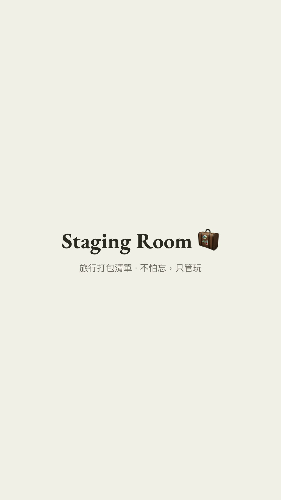

# Staging Room 🧳

**🇬🇧 [English](#english)** · **🇹🇼 [繁體中文](#繁體中文)**

---

## English

> Introducing Staging Room 🧳: a private packing toolbox that remembers everything you have
> ever packed — tap the situations that fit this trip (❄️ 冬天, 🏖️ 海邊, 🚗 Road trip…),
> tick items off as you go, and never have to reinvent the list from scratch again.

### What is this, really?

It's a private webpage that remembers *everything* you might ever want to pack — your
everyday travel gear, plus little themed bundles ("modules") for specific trip types like
winter, beach, business or a road trip. Before a trip, you tap on the modules that apply
(say, "beach" for a tropical holiday), and those items join your core list. Then you
literally tick things off as you pack. Before your next trip, hit reset and start again —
the list itself never forgets what you own, only the ticks reset.

It's not an app you install. It's a single webpage that Claude builds for you and
privately hosts — nobody else can see it unless you choose to share it.

### See it in action

🎬 [Full-quality demo video with music](demo.mp4)

### What you get

- A master packing list organised into sections (bags & gear, carry-on essentials,
  clothes, toiletries, etc.) that you customise to fit how you actually pack.
- "Situational modules" — toggle-able bundles of items that only show up for the right
  kind of trip, so your winter gear doesn't clutter a beach-trip list.
- A live progress bar and count as you tick things off.
- A search box that finds anything in your whole toolbox, even items hidden behind an
  off module.
- Checked-off state lives only on your own phone (never synced anywhere), so a fresh
  device or a "reset" button always gives you a clean slate for the next trip.
- One self-contained file — no ads, no tracking, no sign-up.

### How to make your own — no coding experience needed

You don't need to know how to code. You just need Claude (Claude Code, or a Claude app
with Skills support) and a few minutes.

1. **Get this skill into Claude.** *(see "Installing the skill" below — this part depends
   on which Claude product you're using.)*
2. **Say what you want**, e.g. *"set up a packing list for my trips"*. Claude will read
   `SKILL.md` and take it from there.
3. **Answer a few quick questions** — what language you want the labels in, what sections
   make sense for how you pack, what trip types (modules) you actually need, and what
   accent colour you like. Sensible defaults exist for everything — "just use the
   defaults" is a totally fine answer.
4. **Give Claude your first batch of items** — your usual carry-on essentials, gear you
   own, or a lesson from a recent trip ("I always forget a phone charger"). Claude shows
   you a summary table before saving anything.
5. **Claude publishes it** and gives you a private link. Add it to your phone's home
   screen (Share → Add to Home Screen on iPhone) so it's one tap away before every trip.
6. **Next time**, come back to the same conversation (or a new one, telling Claude the
   link) and say things like *"add a travel kettle to my gear list"* — Claude updates the
   same page rather than creating a new one.

### Installing the skill

This skill works with **Claude Code** — Anthropic's developer tool (available as a
desktop app, a VS Code/JetBrains extension, or a terminal app). It does **not** currently
work in the regular claude.ai chat website, since custom Skills aren't supported there yet.
Dragging the folder into a claude.ai **Project**'s knowledge library doesn't work either —
Claude can read the instructions there, but a Project can't actually run the multi-step
build-and-publish workflow `SKILL.md` describes (copying files, running `build.py`,
publishing an Artifact).

1. **Download this folder.** On GitHub, click the green "Code" button → "Download ZIP"
   (or `git clone` the repo if you're comfortable with git), then find the `staging-room`
   folder inside.
2. **Copy the `staging-room` folder** into a `skills` folder that Claude Code looks in:
   - To use it in *every* project: `~/.claude/skills/staging-room/` (inside your home
     folder — on Mac that's usually `/Users/yourname/.claude/skills/`, on Windows
     `C:\Users\yourname\.claude\skills\`). Create the `skills` folder if it doesn't exist yet.
   - To use it in *one specific project only*: put it in that project's
     `.claude/skills/staging-room/` instead.
3. **Open Claude Code** in that project (or anywhere, if you used the personal folder)
   and either:
   - type `/staging-room`, or
   - just say something like *"set up a packing list for my trips"* — Claude recognises
     the request from the skill's description and picks it up automatically.

No extra installation, sign-up, or payment needed beyond having Claude Code itself.

### Is my data private?

Yes. The tool is published as a **private Claude Artifact** — by default, only you can
open the link while logged into your Claude account. Nothing is public unless you
deliberately share it. The list of what's in your luggage isn't exactly a secret, but
it's yours to share or not.

### What happens to my ticks when I reset?

Only the checkmarks and which modules were switched on get cleared — the master list
itself (every item you've ever added) is untouched. That's the whole point: build the
list once, reuse it for every trip.

### FAQ

- **Do I need to know Python or HTML?** No — Claude runs everything for you. The scripts in
`reference/` exist so Claude doesn't have to reinvent them each time, not for you to run
by hand.

- **What if I have way more than the default section types?** Sections and modules are
just data — add, rename, or remove as many as you like, any time, just by asking Claude.

---

## 繁體中文

> Staging Room 🧳 幫你打造一套可重複使用的旅行打包系統。
>
> 除了每次旅行都會攜帶的常備物品之外，你可以依照每趟旅程加入不同情境（❄️ 滑雪、🏖️ 海邊、
> 🚗 公路旅行等），即可快速生成專屬的打包清單。
>
> 接著只要一項項勾選確認，再也不用每次出門都從零開始重新列打包清單了。

### 什麼是 Staging Room？

Staging Room 是一份「建一次、每趟旅行都能重複使用」的私人打包清單。

清單分成兩層：一層是你每次出門幾乎都會帶的核心裝備；另一層是依旅行情境整理的「情境模組」──冬天、海邊、出差、公路旅行等等。

出發前，點開這趟旅程用得到的模組（例如去沖繩玩水就開「海邊」），這些物品就會加進這次的打包清單；接著一邊打包、一邊勾選，全部打勾就能安心出門。旅程結束後按下重置，下一趟又是一張乾淨的清單──清單本身不會忘記你有哪些東西，重置的只有勾選狀態。

它不是需要安裝的 App，而是 AI 幫你做好、私密託管的一個網頁。除非你主動分享，否則只有你看得到。

### 實際看看

🎬 **[觀看完整示範影片(有背景音樂)](demo.mp4)**

### 你會得到什麼

- 一份照你打包習慣分類的母清單（行李裝備、隨身必備、衣物、盥洗用品……分類全部可以自訂）。
- 「情境模組」：滑雪裝備只在滑雪行程出現，不會塞滿你去海島的清單。
- 打包進度條，勾一項、動一格。
- 搜尋框：整個工具箱都找得到，連還沒開啟的模組裡的物品也搜得出來。
- 勾選狀態只存在你手上這台裝置，不會同步到任何地方；按「重置」隨時回到乾淨狀態，準備下一趟。
- 一個檔案搞定──沒有廣告、沒有追蹤、不用註冊。

### 怎麼建立自己的版本──完全不需要寫程式

你不需要會寫程式，只要有 Claude（Claude Code，或支援 Skills 功能的 Claude App）和幾分鐘的時間。

1. **把這個 skill 裝進 Claude。**（做法見下方「安裝 Skill」。）
2. **說出你的需求**，例如「幫我建一個旅行打包清單」，Claude 會讀取 `SKILL.md`，照流程帶你完成。
3. **回答幾個小問題**──介面語言、分類方式、你常遇到的旅行情境、主題色。每一題都有預設值，回「都用預設就好」也完全沒問題。
4. **把物品交給 Claude**──常備的隨身用品、家裡的旅行裝備，或上一趟旅程的教訓（「我每次都忘記帶充電線」）。Claude 會先列出表格讓你確認，才寫進清單。
5. **Claude 幫你發布**，給你一個私人連結。把它加到手機主畫面（iPhone：分享 → 加入主畫面），出發前一鍵打開。
6. **之後想更新**，回到對話裡說一句「幫我把旅行電水壺加進裝備清單」就好──Claude 會更新同一個頁面，網址不變。

### 安裝 Skill

這個 skill 需要搭配 **Claude Code**──Anthropic 的開發者工具（有桌面版 App、VS Code／JetBrains 外掛，也有終端機版本）。一般的 claude.ai 聊天網站目前**還不支援**自訂 Skills，所以網頁版沒辦法用；把整個資料夾拖進 claude.ai **Project** 的知識庫也行不通──Claude 讀得到裡面的說明，但 Project 無法真的執行 `SKILL.md` 裡的建置流程（複製檔案、跑 `build.py`、發布 Artifact）。

1. **下載這個資料夾。** 在 GitHub 頁面點綠色的「Code」按鈕 → 「Download ZIP」（會用 git 的話，直接 `git clone` 整個 repo 也行），解壓後找到裡面的 `staging-room` 資料夾。
2. **把 `staging-room` 資料夾複製**到 Claude Code 會讀取的 `skills` 資料夾：
   - 想在**所有專案**都能用：放到 `~/.claude/skills/staging-room/`（在你的使用者資料夾裡，Mac 通常是 `/Users/你的名字/.claude/skills/`，Windows 是 `C:\Users\你的名字\.claude\skills\`）。還沒有 `skills` 資料夾的話，自己建一個就好。
   - 只想在**單一專案**使用：放到該專案的 `.claude/skills/staging-room/`。
3. **打開 Claude Code**（放在單一專案就要在該專案開；放在個人資料夾則任何專案都可以），接著：
   - 輸入 `/staging-room`，或
   - 直接說「幫我建一個旅行打包清單」──Claude 會從 skill 的描述自動認出來、接手處理。

除了 Claude Code 本身之外，不需要任何額外安裝、註冊或付費。

### 我的資料安全嗎？

安全。這個工具是以**私人 Claude Artifact** 的形式發布──預設只有登入你自己 Claude 帳號時才打得開，除非你主動分享，否則不會公開。打包清單本來也稱不上什麼機密，但要不要給別人看，決定權在你。

### 按下重置後，我的資料會不見嗎？

不會。被清空的只有勾選狀態和開啟中的模組；母清單本身──你加過的每一項物品──原封不動。這正是這個工具的重點：清單建一次，之後每趟旅行都能一直用下去。

### 常見問題

- **需要會 Python 或 HTML 嗎？** 不用──全部由 Claude 代勞。`reference/` 裡的程式是給 Claude 重複使用的，不是要你自己動手跑。

- **預設的分類不夠用怎麼辦？** 分類（sections）和模組（modules）都只是資料，隨時跟 Claude 說一聲，要新增、改名還是刪除都可以，沒有數量限制。

---

*This skill is part of [ec-vibes](https://github.com/cloudarchitectec/ec-vibes). MIT licensed — see the repo's [LICENSE](../LICENSE).*
