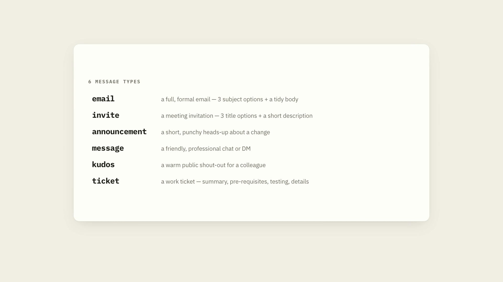

# Text Polish ✨ — Less Typing. Better Writing.　寫得更少，說得更好。


 
*[English](#english) · [繁體中文](#繁體中文)*
 
---
 
## English
 
**Ever stared at a blank message, unsure how to word it professionally?** Text Polish turns your rough notes, bullet points, and half-formed thoughts into clean, confident, ready-to-send messages — in seconds. Whether it's a formal email, a meeting invite, a team announcement, a quick chat, a public shout-out to a colleague, or a Jira ticket, you just jot down the keywords and key details and the AI gives you ready-to-send English text for the occasion. No writing skills, no technical know-how, no fuss. Less typing. Better writing.

### See it in action


🎬 [Full-quality demo video](demo.mp4)
 
### Why you'll love it
- ⏱️ **Saves time** — no more agonising over wording.
- 💬 **Right tone for every occasion** — an email sounds like an email; a chat sounds like a chat.
- 🧠 **Keeps your meaning** — it polishes your words, it never makes up facts.
- 📋 **Copy-and-paste ready** — get a finished message, not a rough draft.
- 🌏 **Works with any AI assistant** — GitHub Copilot, Claude, Codex/ChatGPT, or use it as your own prompt library.
 
### Works with any assistant
Text Polish is an Agent Skill (a single `SKILL.md` file). Set it up whichever way fits your tool:
 
| Your assistant | How to set it up |
|----------------|------------------|
| **GitHub Copilot CLI** | Copy the `text-polish` folder into `~/.copilot/skills/` so you have `~/.copilot/skills/text-polish/SKILL.md`. Start a new chat. |
| **Claude Code** | Copy the folder into `~/.claude/skills/text-polish/` (available in all projects) **or** `.claude/skills/text-polish/` inside one project. Start a new chat. |
| **Claude desktop / web app** | Go to **Settings → Capabilities → Skills** and upload the `text-polish` folder (needs code execution enabled). |
| **OpenAI Codex CLI** | Copy the folder into `~/.agents/skills/text-polish/` (all repos) **or** `.agents/skills/text-polish/` in a repo. Restart Codex if it doesn't appear. |
| **Gemini CLI** | Open `SKILL.md`, copy everything, and paste it into `~/.gemini/GEMINI.md` (global) or `./GEMINI.md` in your project. |
| **ChatGPT / Gemini / Claude (web, no folder)** | Open `SKILL.md`, copy everything, and paste it into **Custom Instructions**, a **saved prompt**, or a **Custom GPT / Gem**. Then just chat. |
 
The **first time** you use it, it asks two quick setup questions (your English preference, and whether the default message types suit you). You can change these anytime later.
 
### How to use it — examples
Trigger it with a short command **or** plain language, then paste your notes. Examples for each type:
 
**📧 1. Email** — a formal email with 3 subject-line options + a tidy body
```
text-polish email
Notes: need to push the Thursday review to next week, ask if Tuesday 2pm works, apologise for short notice
```
 
**📅 2. Invite** — a meeting invitation with 3 title options + a short description
```
text-polish invite
polish this as a meeting invite: 30 min catch-up with the design team to agree the new logo, need everyone to bring their draft ideas
```
 
**📣 3. Announcement** — a short, punchy heads-up about a change
```
text-polish announcement
Notes: from Monday the office kitchen is closed for refurb for 2 weeks, use the 3rd floor kitchen instead
```
 
**💬 4. Message** — a friendly, professional chat/DM
```
text-polish message
tidy this into a Teams message: hey can you send over the Q3 numbers when you get a sec, no rush, thanks
```
 
**🎉 5. Kudos** — a warm public shout-out for a colleague
```
text-polish kudos
write a kudos: Sarah stayed late to fix the booking system before the demo, totally saved us
```
 
**🎫 6. Jira Ticket** — a work ticket with title + Summary, Pre-Requisites, Testing, Technical Details
```
text-polish ticket
Notes: test the new expense-report export, check it works for the finance team, fix anything that looks off
```
 
### Good to know
- **Language** — it currently produces polished text in English; the other languages here are just for these instructions.
- It **never invents facts.** If something's missing (like a date or name), it leaves a `[placeholder]` for you to fill in.
- It only **cleans up your wording** — it doesn't send, post, or fact-check anything. That's still up to you.
- It polishes tone in the **same language** — it isn't a translator.
 
---
 
## 繁體中文
 
**曾經對著空白訊息發呆，不知道怎麼寫得專業得體嗎？** Text Polish 能把你隨手記下的重點、片段、還沒想清楚的句子，在幾秒內變成乾淨、有自信、可以直接送出的訊息。不論是正式電子郵件、會議邀請、團隊公告、簡短聊天訊息、公開表達對同事的感激與 shout out，還是建立新的 Jira Tickets。你只要列出關鍵字跟重要資訊，AI 就會回給你可以直接送出的英文文字（適用於不同場景）。不需要寫作技巧、不需要技術背景、完全不費力。讓你寫得更少，說得更好。

### 實際運作的樣子


🎬 **[觀看完整示範影片](demo.mp4)**
 
### 為什麼你會喜歡它
- ⏱️ **節省時間** — 不用再為遣詞用字傷腦筋。
- 💬 **適用於不同場合的專屬情境** — 郵件像郵件、聊天像聊天。
- 🧠 **保留你的原意** — 只潤飾用字，絕不捏造事實。
- 📋 **可直接複製貼上** — 給你的是完成品，不是草稿。
- 🌏 **搭配任何 AI 助理** — GitHub Copilot、Claude、Codex/ChatGPT，也可以作為你自己的提示詞庫(prompt library)。
 
### 適用於任何 AI 助理
Text Polish 就是一個 Agent Skill（`SKILL.md`），可以根據你的 AI 工具選擇設定方式：
 
| 你的助理 | 設定方式 |
|----------|----------|
| **GitHub Copilot CLI** | 把 `text-polish` 資料夾複製到 `~/.copilot/skills/`，讓路徑成為 `~/.copilot/skills/text-polish/SKILL.md`，然後開啟新的對話。 |
| **Claude Code** | 把資料夾複製到 `~/.claude/skills/text-polish/`（所有專案皆可用），或放到單一專案內的 `.claude/skills/text-polish/`，然後開啟新的對話。 |
| **Claude 桌面版／網頁版** | 進入 **Settings → Capabilities → Skills**，上傳 `text-polish` 資料夾（需啟用程式碼執行 code execution）。 |
| **OpenAI Codex CLI** | 把資料夾複製到 `~/.agents/skills/text-polish/`（所有 repo 皆可用），或放到 repo 內的 `.agents/skills/text-polish/`。若沒出現，重新啟動 Codex。 |
| **Gemini CLI** | 打開 `SKILL.md` 全選複製，貼到 `~/.gemini/GEMINI.md`（全域）或專案內的 `./GEMINI.md`。 |
| **ChatGPT／Gemini／Claude（網頁版，無資料夾）** | 打開 `SKILL.md`，全選複製，貼到**自訂指示（Custom Instructions）**、**儲存的提示詞**，或 **Custom GPT／Gem** 裡，接著直接對話即可。 |
 
**第一次**使用時，它會問你兩個簡單的設定問題（你偏好的英文版本，以及預設的訊息類型是否合用）。之後可以隨時修改。
 
### 使用方式 — 範例
用簡短指令**或**自然語言觸發，然後貼上你的筆記。以下是各類型的範例：
 
**📧 1. Email（電子郵件）** — 正式郵件，提供 3 個主旨選項＋完整內文
```
text-polish email
Notes: need to push the Thursday review to next week, ask if Tuesday 2pm works, apologise for short notice
```
 
**📅 2. Invite（會議邀請）** — 提供 3 個標題選項＋簡短說明
```
text-polish invite
polish this as a meeting invite: 30 min catch-up with the design team to agree the new logo, need everyone to bring their draft ideas
```
 
**📣 3. Announcement（公告）** — 簡潔有力地宣布公告
```
text-polish announcement
Notes: from Monday the office kitchen is closed for refurb for 2 weeks, use the 3rd floor kitchen instead
```
 
**💬 4. Message（聊天訊息）** — 友善又專業的聊天／私訊
```
text-polish message
tidy this into a Teams message: hey can you send over the Q3 numbers when you get a sec, no rush, thanks
```
 
**🎉 5. Kudos（讚美）** — 給同事的溫暖公開肯定
```
text-polish kudos
write a kudos: Sarah stayed late to fix the booking system before the demo, totally saved us
```
 
**🎫 6. Jira Ticket（工作任務單）** — 含標題＋摘要、前置需求、測試、技術細節
```
text-polish ticket
Notes: test the new expense-report export, check it works for the finance team, fix anything that looks off
```
 
### 需要知道的事
- 語言：目前潤飾內容以英文輸出為主；中文為使用說明。
- 它**絕不捏造事實**。若缺少資訊（例如日期或姓名），會留下 `[placeholder]` 佔位符讓你自行填入。
- 它只**潤飾你的文字** — 不會替你送出、發布或查證任何內容，這些仍由你負責。
- 它在**同一種語言內**潤飾語氣 — 它不是翻譯工具。